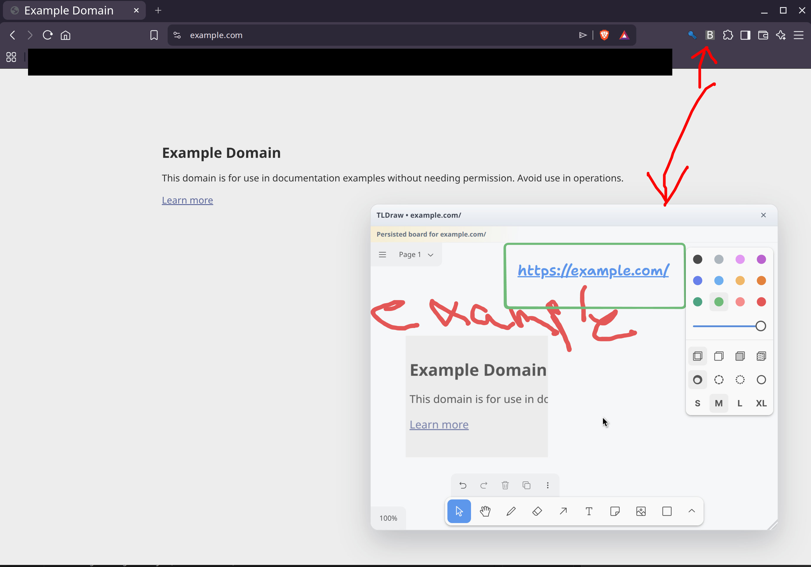

# BKMK TLDraw Overlay

Chrome and Brave extension that opens a bundled local tldraw editor as an overlay in the upper-right of the current page.

## Screenshot



## Features

- Click the extension action button to toggle the overlay.
- The overlay opens at about 25% of the viewport in the upper-right.
- The overlay can be dragged and resized.
- Each page gets its own persisted board.
- Persistence is stored as tldraw snapshots inside a bundled SQLite database running through `wa-sqlite` with IndexedDB-backed storage.

## Requirements

- Node.js and npm
- Chrome or Brave

## Development

Install dependencies:

```bash
npm install
```

Build the extension:

```bash
npm run build
```

Build and create a distributable zip:

```bash
npm run package
```

Rebuild on changes:

```bash
npm run dev
```

## Installation

### Load unpacked in Chrome or Brave

1. Open `brave://extensions` or `chrome://extensions`.
2. Enable Developer mode.
3. Click Load unpacked.
4. Select the `dist` directory.

### Create a distributable zip

Use the packaging script:

```bash
npm run package
```

This creates a versioned zip such as `bkmktldraw-0.1.0.zip` at the project root with `manifest.json` at the zip root.

If you share the zip directly, recipients still need to extract it and use Load unpacked on the extracted folder.

### Chrome Web Store

The same zip produced by `npm run package` can be uploaded to the Chrome Web Store developer dashboard.

## Architecture

- `src/background.ts` handles the extension action click, rejects unsupported tabs such as `chrome://` pages, ensures the content script is available, and sends the toggle message.
- `src/content/index.ts` injects the draggable and resizable overlay shell into the current page, mounts it in a shadow root, and loads `overlay.html` in an iframe.
- `src/overlay/OverlayApp.tsx` reads the page context from the iframe query string, loads the saved board, and lazy-loads the editor runtime only when the overlay is opened.
- `src/overlay/TldrawEditor.tsx` mounts `tldraw` inside the overlay iframe and autosaves board snapshots after edits.
- `src/storage/board-store.ts` initializes `wa-sqlite` with an IndexedDB-backed VFS and stores one serialized `tldraw` snapshot per page key.

### Runtime flow

1. Click the extension action button.
2. The background script injects or pings the content script for the current tab.
3. The content script toggles the overlay shell and iframe on the page.
4. The overlay app loads the board for the current page key.
5. Edits are saved back into the local SQLite database stored in IndexedDB.

## Current defaults

- Board scope: one board per full page URL without the hash fragment.
- Overlay interaction: only the overlay captures input; the rest of the page stays clickable.
- Storage backend: IndexedDB-backed SQLite via `wa-sqlite` async WASM.

## Known limitations

- Browser internal pages such as `brave://`, `chrome://`, and other protected extension pages cannot be scripted by normal extensions.
- Board data is stored locally in the browser profile through IndexedDB-backed SQLite and does not sync across devices.
- Manual zip distribution is not a one-click install path for Chrome; users still need to extract the archive and use Load unpacked unless the extension is published through the Chrome Web Store.
- The on-demand editor runtime is still relatively large because it includes the `tldraw` editor and the SQLite/WASM stack, even though the initial overlay entry has been split down.

## Roadmap

- Continue reducing the size and chunk count of the on-demand editor runtime.
- Add controls for resetting, exporting, or duplicating a page board.
- Support configurable overlay position and size defaults.
- Evaluate sync or import/export options beyond local browser storage.

## Release checklist

1. Run `npm install` if dependencies have changed.
2. Run `npm run package`.
3. Verify the extension by loading the generated `dist` folder unpacked in Chrome or Brave.
4. Upload the generated versioned zip such as `bkmktldraw-0.1.0.zip` to the Chrome Web Store, or share it for manual extraction and unpacked loading.

## Notes

- The `tldraw` SDK has its own licensing terms for production use.